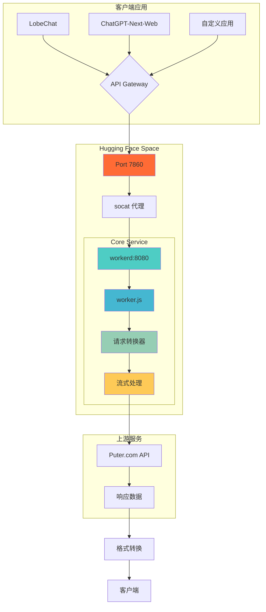
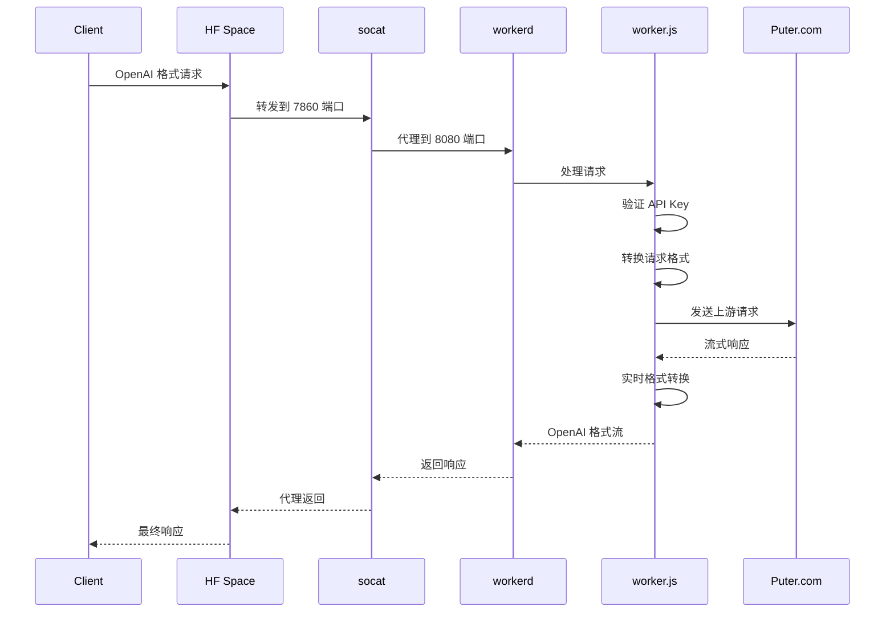

# puterjs-2api-huggingface 🚀

**将 [Puter.js](https://docs.puter.com/) 的强大AI能力，转化为符合 OpenAI 标准的私有 API 服务！**

<div align="center">

[](https://huggingface.co/new-space?template=lza6/puterjs-2api-huggingface)
[](https://opensource.org/licenses/Apache-2.0)
[](https://github.com/lza6/puterjs-2api-huggingface)

</div>

---

## 🎯 项目哲学

> **从消费者到创造者的转变**
> 
> 在数字时代，我们常常被动接受技术，而非主动塑造它。这个项目是一个宣言：**你不仅能使用API，更能创造、转换和重塑它们**。它不仅仅是一个工具，更是一座桥梁，连接封闭的商业生态与开放的开发者世界。
> 
> 当你部署这个项目时，你不仅启动了一个服务，更是在践行一种信念：**技术应当为人服务，并由人塑造**。这就是开源精神的核心——赋予每个人成为创造者的力量。

---

## ✨ 核心特性

<div align="center">

| 功能 | 状态 | 描述 |
|------|------|-------------|
| 🗣️ 聊天对话 | ✅ 完全可用 | 支持 GPT-4o-mini 等模型 |
| 🖼️ 图像生成 | 🟡 部分可用 | 文生图功能正在修复 |
| 🎬 视频生成 | 🔄 框架就绪 | 等待上游支持 |
| 🔐 API 认证 | ✅ 完全可用 | 支持 Bearer Token |
| 🌐 Web UI | ✅ 完全可用 | 内置开发者驾驶舱 |

</div>

### 🎨 主要优势

- **🚀 零成本部署** - 利用 Hugging Face Spaces 免费资源
- **🎯 完全兼容** - 100% OpenAI API 格式兼容
- **⚡ 超高性能** - 基于 Cloudflare workerd 运行时
- **🔧 完全掌控** - 代码开源，数据私有
- **🎪 多模态支持** - 支持文本、图像、视频生成

---

## 🏗️ 系统架构

### 📊 架构总览



### 📁 项目结构

```
puterjs-2api-huggingface/
├── 🚀 app.py              # HF Spaces 入口启动器
├── ⚙️ config.capnp        # workerd 核心配置
├── 📋 requirements.txt    # Python 依赖声明
├── 🎬 start.sh           # 核心部署脚本
├── 🧠 worker.js          # 请求处理大脑
└── 📖 README.md          # 项目文档
```

---

## 🚀 快速开始

### 方法一：一键部署（推荐）

<div align="center">

[](https://huggingface.co/new-space?template=lza6/puterjs-2api-huggingface)

</div>

1. **点击上方按钮**进入部署页面
2. **设置空间信息**：
   - `Space name`: 你的空间名称
   - `Visibility`: 选择 `Public`
3. **点击创建**并等待构建完成（2-5分钟）
4. **访问你的空间**获取 API 端点

### 方法二：手动部署

```bash
# 克隆项目
git clone https://github.com/lza6/puterjs-2api-huggingface.git
cd puterjs-2api-huggingface

# 推送到 Hugging Face
git push https://huggingface.co/spaces/your-username/your-space-name
```

---

## 🔧 配置使用

### 📝 获取 API 信息

部署成功后，访问你的空间 URL，在**开发者驾驶舱**中获取：

- **API 端点**: `https://your-space-name.hf.space`
- **API 密钥**: `1` (默认)

### 🔌 客户端配置示例

#### 1. LobeChat / One-API

```yaml
API Key: "1"
API 地址: "https://your-space-name.hf.space"  # 注意：不要加 /v1
```

#### 2. ChatGPT-Next-Web

```bash
# 环境变量配置
CODE=1
BASE_URL=https://your-space-name.hf.space/v1
CUSTOM_MODELS=+gpt-4o-mini,+gpt-4o,+gemini-1.5-flash
```

#### 3. Python 脚本

```python
import openai

client = openai.OpenAI(
    api_key="1",
    base_url="https://your-space-name.hf.space/v1"
)

response = client.chat.completions.create(
    model="gpt-4o-mini",
    messages=[{"role": "user", "content": "Hello!"}],
    stream=True
)
```

---

## 🔬 技术深度解析

### 🔄 请求处理流程



### 🛠️ 技术栈详解

| 组件 | 角色 | 技术特点 | 难度 |
|------|------|----------|------|
| **Hugging Face Spaces** | 部署平台 | 免费计算资源，自动CI/CD | ⭐ |
| **`app.py` + `os.execv`** | 进程管理器 | 优雅的进程交接 | ⭐⭐ |
| **`socat`** | 端口代理 | 轻量级网络重定向 | ⭐⭐⭐ |
| **`workerd`** | JavaScript 运行时 | 边缘计算优化，高性能 | ⭐⭐⭐⭐ |
| **`worker.js`** | 业务逻辑核心 | 请求转换、流式处理 | ⭐⭐⭐⭐ |
| **`TransformStream`** | 数据流处理 | 实时格式转换 | ⭐⭐⭐⭐ |

### 💡 核心技术：流式转换

```javascript
// 实时转换 Puter.com 流到 OpenAI 格式
const transformStream = new TransformStream({
    transform(chunk, controller) {
        const lines = chunk.split('\n');
        for (const line of lines) {
            if (line.startsWith('data: ')) {
                const data = line.slice(6);
                if (data === '[DONE]') {
                    controller.enqueue('data: [DONE]\n\n');
                } else {
                    // 格式转换逻辑
                    const openaiFormat = convertToOpenAIFormat(data);
                    controller.enqueue(`data: ${JSON.stringify(openaiFormat)}\n\n`);
                }
            }
        }
    }
});
```

---

## 📊 项目状态与发展路线

### ✅ 已完成功能

- [x] **核心聊天代理** - 完整的 OpenAI 兼容接口
- [x] **流式响应** - 支持实时对话体验
- [x] **模型列表接口** - `/v1/models` 端点
- [x] **API 认证** - Bearer Token 支持
- [x] **开发者 UI** - 集成测试驾驶舱
- [x] **自动化部署** - 一键部署脚本

### 🚧 当前限制

<div align="center">

| 功能模块 | 状态 | 问题描述 | 优先级 |
|----------|------|----------|---------|
| 图像生成 | 🟡 部分可用 | 文生图接口需要调试 | 高 |
| 配置管理 | 🟡 需要优化 | 硬编码 token | 中 |
| 错误处理 | 🟡 基础支持 | 需要增强日志系统 | 中 |
| 多上游支持 | 🔄 规划中 | 单点依赖风险 | 低 |

</div>

### 🗺️ 发展路线图

#### 🎯 V1.5 - "磐石计划" (稳定性提升)
- **环境变量配置** - 支持 Secrets 管理
- **图像生成修复** - 完全恢复文生图功能
- **增强日志系统** - 结构化日志输出

#### 🚀 V2.0 - "百川计划" (功能扩展)
- **多上游负载均衡** - 消除单点故障
- **健康检查机制** - 自动故障转移
- **插件化架构** - 支持多AI服务商

#### 🌟 V3.0 - "创世计划" (平台化)
- **用户管理系统** - 多租户支持
- **用量统计** - 调用监控与分析
- **高级UI界面** - 现代化管理面板

---

## 🤝 贡献指南

我们欢迎所有形式的贡献！无论是代码改进、文档优化还是功能建议。

### 🛠️ 开发流程

1. **Fork 项目**
   ```bash
   git clone https://github.com/lza6/puterjs-2api-huggingface.git
   ```

2. **创建特性分支**
   ```bash
   git checkout -b feature/AmazingFeature
   ```

3. **提交更改**
   ```bash
   git commit -m 'Add some AmazingFeature'
   ```

4. **推送分支**
   ```bash
   git push origin feature/AmazingFeature
   ```

5. **创建 Pull Request**

### 🐛 问题报告

如果你发现任何问题，请通过 [GitHub Issues](https://github.com/lza6/puterjs-2api-huggingface/issues) 报告。

---

## 📜 开源协议

本项目采用 [Apache 2.0](https://opensource.org/licenses/Apache-2.0) 开源协议。

---

<div align="center">

## 🌟 开始创造吧！

**每一次部署，都是你在数字世界留下的独特印记。**
**每一次贡献，都是在为开源生态添砖加瓦。**

[](https://huggingface.co/new-space?template=lza6/puterjs-2api-huggingface)

*让技术为你所用，而非被技术所用*

</div>
